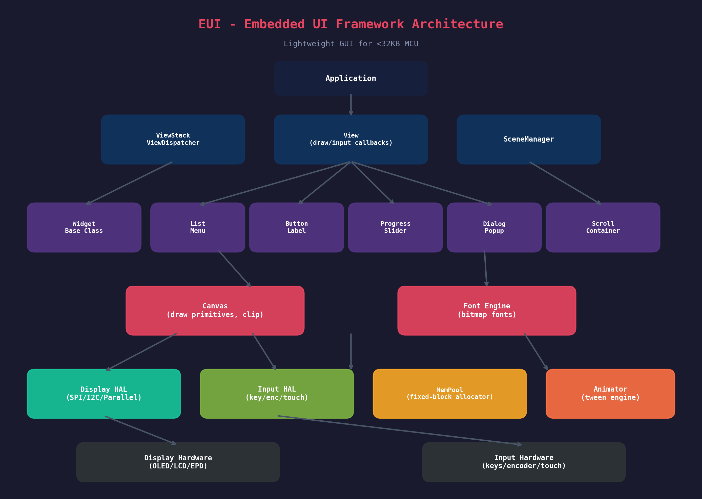
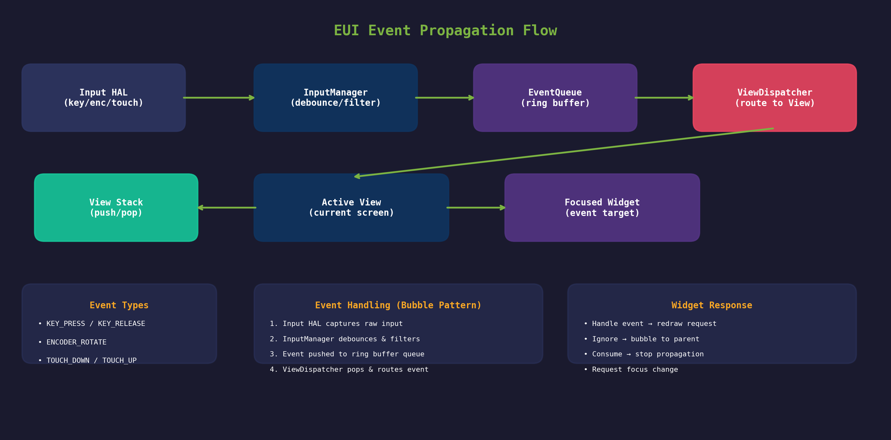
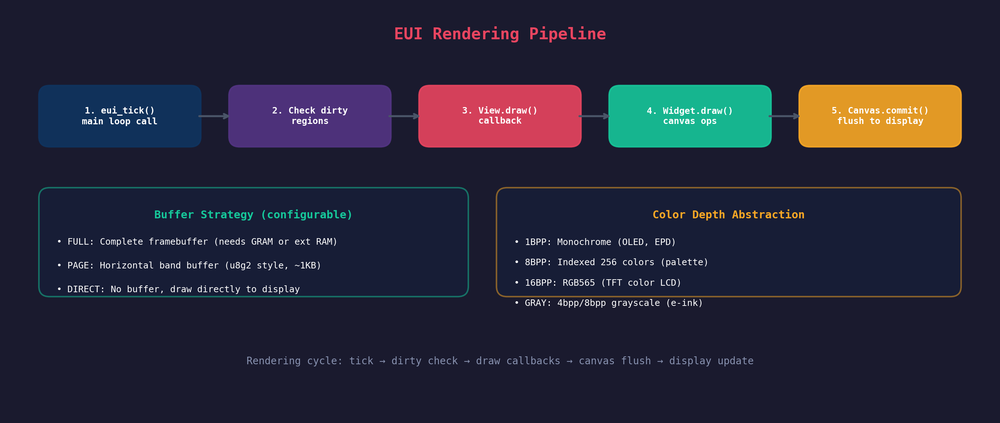

# EUI — 嵌入式轻量级UI框架设计文档

**版本**: 1.0  
**目标平台**: 内存低于 32KB 的 MCU（ARM Cortex-M0+/M3、AVR、ESP8266 等）  
**参考架构**: Flipper Zero GUI、µGUI、U8G2、fgui  
**支持屏幕**: 单色 OLED/EPD、彩色 TFT（1bpp / 8bpp / 16bpp）  
**输入设备**: 按键（方向键+确认+返回）、旋转编码器、电阻/电容触摸屏（有限支持）

---

## 1. 设计目标与核心约束

本框架面向资源极度受限的嵌入式环境，其核心设计哲学可以概括为**"框架管理，控件自治"**——框架负责视图的调度、输入事件的分发和渲染时序的协调，而每个控件（Widget）则完全负责自身区域内的绘制逻辑和状态维护。这种职责分离使得框架本身保持极小的内存占用，同时为应用程序提供充分的灵活性。

### 1.1 内存约束与预算分配

在典型 **32KB RAM** 的 MCU 上，内存分配需要精确规划。以 STM32F103C8T6（20KB SRAM）或 STM32G0 系列（8~36KB SRAM）为例，框架运行时的内存预算可参考如下分配方案：

| 内存区域 | 大小 | 用途说明 |
|---------|------|---------|
| **TLSF 内存池** | 4~8 KB | Widget、View、Canvas 结构体、运行时对象 |
| **帧缓冲区 / Page Buffer** | 1~4 KB | 按显示策略分配：PAGE 模式约 1KB，FULL 模式需外接 GRAM |
| **栈空间** | 2~4 KB | 回调嵌套、中断服务程序 |
| **字体与图像资源** | 4~8 KB | 位图字体、图标、XBM 图像（可放 Flash） |
| **应用数据** | 4~8 KB | 用户模型数据、业务逻辑变量 |
| **保留/空闲** | 2~4 KB | 应对突发分配、DMA 缓冲等 |

框架本身（代码段+静态数据）的 **Flash 占用目标控制在 16~32 KB** 之间，通过条件编译和模块化裁剪，可以进一步缩减到 **8 KB 以下**（仅保留核心 View + Canvas + 1~2 个基础控件）。

### 1.2 关键设计决策

基于对 Flipper Zero GUI  [(flipperzero-firmware/applications/services/gui/canvas.h at dev · flipperdevices/flipperzero-firmware · GitHub)](https://github.com/flipperdevices/flipperzero-firmware/blob/dev/applications/services/gui/canvas.h) 、µGUI  [(UGUI/ugui.h at master · achimdoebler/UGUI · GitHub)](https://github.com/achimdoebler/UGUI/blob/master/ugui.h)  和 U8G2  [(Open Source Embedded Project)](https://osrtos.com/library/u8g2/)  的深入分析，本框架做出以下关键架构决策：

**零动态内存分配**：框架内部完全不使用标准库的 `malloc()` / `free()`，所有对象通过内建的 TLSF（Two-Level Segregated Fit）分配器从预先分配的静态缓冲区中分配。TLSF 算法确保分配和释放操作具有 **O(1)** 的确定性时间复杂度，同时通过即时合并机制将内存碎片率控制在最优水平，对实时性要求高的嵌入式场景至关重要。

**回调驱动的视图架构**：借鉴 Flipper Zero 的 View 设计  [(flipperzero-firmware/applications/services/gui/view.h at dev · flipperdevices/flipperzero-firmware · GitHub)](https://github.com/flipperdevices/flipperzero-firmware/blob/dev/applications/services/gui/view.h) ，每个视图通过一组函数指针（绘制回调、输入回调、进入/退出回调）与框架交互，而非强制继承固定的基类结构。这种设计在 C 语言中实现了类似面向对象的松耦合，同时避免了虚函数表带来的额外内存开销。

**显示抽象与多缓冲策略**：参考 U8G2 的 Page Buffer 机制  [(Open Source Embedded Project)](https://osrtos.com/library/u8g2/) ，框架支持三种渲染模式（FULL / PAGE / DIRECT），由显示驱动在初始化时声明其能力，框架自动选择最优策略。单色和彩色显示通过统一的颜色抽象层处理，应用代码无需关心底层像素格式。

---

## 2. 框架整体架构

### 2.1 层次结构

EUI 框架采用清晰的五层架构，自下而上依次为硬件抽象层、基础服务层、图形引擎层、视图管理层和应用层。每一层只依赖下层提供的服务，上层对下层不可见，这种严格的单向依赖保证了框架的可移植性和可测试性。



**硬件抽象层（HAL）** 是框架与具体硬件之间的唯一接合点，包含显示驱动接口 `DisplayHAL`、输入设备接口 `InputHAL` 和定时器接口 `TimerHAL`。移植到新平台时，只需实现这三个接口即可，框架核心代码完全不需要修改。

**基础服务层** 提供内存管理和动画调度两个核心服务。`MemPool` 模块基于 TLSF 算法实现二级分段适配内存分配器，`Animator` 模块为 MotionC 引擎构建薄适配层，提供基于 Q16.16 定点数的补间动画和弹簧物理引擎。这两个模块均不依赖上层，可被独立使用。

**图形引擎层** 由 `Canvas`（画布）和 `FontEngine`（字体引擎）组成。Canvas 是所有绘制操作的核心，管理绘图状态（颜色、字体、裁剪区）并提供完整的绘图原语集。FontEngine 处理位图字体的解析和渲染，支持等宽和变宽字体。

**视图管理层** 是框架的核心协调者，包含 `View`（视图）、`ViewDispatcher`（视图调度器，内部集成 `ViewStack`）和 `SceneManager`（场景管理器）三个核心组件。View 是屏幕上的一块独立区域，通过单一事件处理器（handler）处理绘制、输入、生命周期事件；ViewDispatcher 管理多个 View 之间的切换，并通过内部 overlay 栈支持弹窗覆盖；SceneManager 提供基于场景ID的导航支持。

**控件层（Widget）** 建立在 View 机制之上，提供一系列预构建的 UI 控件。每个 Widget 是一个自包含的 View 实例，封装了特定交互模式（如列表选择、菜单导航、按钮点击）。框架提供 `Widget` 基类定义统一接口，应用开发者可自由扩展自定义控件。

### 2.2 模块依赖关系

```
Application
    │
    ├── ViewDispatcher
    │       │
    │       ├── View (handler: draw/input/enter/exit events)
    │       │       │
    │       │       ├── Widget (List, Menu, Button, Label, ...)
    │       │       │       │
    │       │       │       └── Canvas (draw primitives, clip)
    │       │       │               │
    │       │       │               ├── DisplayHAL (SPI/I2C/Parallel)
    │       │       │               ├── FontEngine (bdf + VLW fonts)
    │       │       │               └── MemPool (TLSF allocator)
    │       │       │
    │       └── SceneManager (scene navigation)
    │
    └── InputHAL → InputManager → EventQueue

MotionC (mc_animate, mc_easing, mc_spring) ──→ Animator → Widget
```

---

## 3. 内存管理子系统（MemPool）

### 3.1 TLSF 分配器设计

在内存低于 32KB 的 MCU 上，标准库的 `malloc()` 实现通常存在两个致命问题：一是分配/释放时间不确定，可能引入不可预测的延迟；二是长期运行后必然产生内存碎片，导致分配失败。EUI 采用 **TLSF（Two-Level Segregated Fit）** 动态内存分配算法，从根本上解决这两个问题。

TLSF 是一种专为实时嵌入式系统设计的通用内存分配算法，具有以下特性：

- **O(1) 时间复杂度**：分配与释放操作时间确定且恒定，不依赖内存使用状态
- **低碎片化**：通过两级分段适配策略，碎片率控制在接近最优水平
- **即时合并**：释放时立即合并相邻空闲块，无需周期性 GC
- **成熟稳定**：已被 FreeRTOS、PX5 RTOS、ESP32 等多个嵌入式平台采用

框架在一个预分配的静态内存区域上初始化 TLSF 分配器。所有运行时对象的分配与释放均通过该分配器完成，彻底消除了对标准库 `malloc()` / `free()` 的依赖。

### 3.2 外部分配器接口

为最大程度保持灵活性，EUI 通过函数指针结构体抽象底层分配器，支持用户自定义分配实现：

```c
/* 分配器接口 */
typedef struct {
    void* (*alloc)(size_t size, void *ctx);
    void  (*free)(void *ptr, void *ctx);
    void* ctx;                       /* 用户上下文（如 TLSF 实例指针） */
} eui_allocator_t;

/* 设置全局分配器 */
void eui_set_allocator(const eui_allocator_t *allocator);

/* 框架内部使用：通过统一的宏调用 */
#define eui_malloc(n)  g_eui_allocator.alloc(n, g_eui_allocator.ctx)
#define eui_free(p)    g_eui_allocator.free(p, g_eui_allocator.ctx)
```

默认情况下，框架在 `eui_init()` 中内建一个 TLSF 分配器实例，绑定到用户提供的静态缓冲区。如果用户未在配置中指定内存池大小，框架使用内部预分配的默认池（8KB，编译时可调整）。

### 3.3 静态缓冲区配置

应用在编译时分配一块连续内存用于 TLSF 分配器：

```c
/* eui_config.h - 内存池配置 */
#define EUI_MEM_POOL_SIZE   8192    /* TLSF 池总大小: 8KB */
```

运行时初始化：

```c
/* 应用提供静态缓冲区 */
static uint8_t eui_mem_buffer[EUI_MEM_POOL_SIZE];

eui_config_t cfg = {
    .mem_pool_buffer = eui_mem_buffer,
    .mem_pool_size = EUI_MEM_POOL_SIZE,
    /* ... */
};
eui_init(&cfg);
```

### 3.4 零分配设计模式

框架内部所有结构体的分配都通过 TLSF 分配器完成，但为了进一步降低内存消耗，框架广泛采用**静态实例化**模式：应用开发者可以在编译时静态分配 Widget 或 View 的实例，完全绕过运行时分配。例如：

```c
/* 静态实例化：零运行时分配 */
static EUI_LIST(my_list, 5);           /* 最多5项的列表控件 */
static EUI_MENU(main_menu, 8);         /* 最多8项的菜单控件 */
static eui_view_t settings_view;        /* 静态View实例 */
```

这种模式在资源极其受限（如 8KB SRAM）的场景下尤为重要，可以将全部运行时内存用于帧缓冲区和应用数据。

---

## 4. Canvas 绘图系统

### 4.1 设计理念

Canvas 是本框架的图形渲染核心，其设计直接参考了 Flipper Zero 的 Canvas API  [(flipperzero-firmware/applications/services/gui/canvas.h at dev · flipperdevices/flipperzero-firmware · GitHub)](https://github.com/flipperdevices/flipperzero-firmware/blob/dev/applications/services/gui/canvas.h)  和 U8G2 的绘图模型  [(Github)](https://github.com/olikraus/u8g2/wiki/u8g2reference) 。Canvas 采用**即时模式（Immediate Mode）**渲染——每次绘图调用立即修改缓冲区或输出到显示设备，不维护复杂的场景图或显示列表。这种模式代码量小、执行路径短、内存占用低，非常适合小内存 MCU。

每个 Canvas 实例绑定一个显示设备和一个帧缓冲区（或 Page Buffer）。Canvas 维护一组**绘图状态**：当前颜色、当前字体、当前裁剪矩形、当前画笔模式（正常 / 异或 / 透明）。状态在 `eui_canvas_reset()` 时恢复默认值，应用可以通过 `eui_canvas_save()` / `eui_canvas_restore()` 进行状态栈操作（状态栈深度可配置，默认 4 层）。

### 4.2 颜色抽象（单色 + 彩色统一）

为了同时支持单色和彩色屏幕，EUI 定义了一套抽象颜色类型 `eui_color_t`。在编译时通过 `EUI_COLOR_DEPTH` 宏选择颜色模式，框架自动适配内部像素格式。

| 颜色模式 | 宏定义 | 像素格式 | 典型应用 | 每像素位数 |
|---------|-------|---------|---------|----------|
| **单色** | `EUI_COLOR_1BPP` | 0=黑, 1=白 | OLED 128x64, EPD | 1 |
| **灰度** | `EUI_COLOR_GRAY4` | 4bpp 灰度 | E-ink 电子墨水屏 | 4 |
| **索引色** | `EUI_COLOR_8BPP` | 8bpp 调色板 | 复古风格彩色屏 | 8 |
| **高彩色** | `EUI_COLOR_16BPP` | RGB565 | TFT 彩色液晶屏 | 16 |

```c
/* 颜色抽象类型 */
typedef enum {
    EUI_COLOR_BLACK = 0,
    EUI_COLOR_WHITE = 1,
    EUI_COLOR_XOR   = 2,    /* 异或模式（反色），仅1BPP支持 */
} eui_color_id_t;

/* 运行时颜色值（实际类型取决于编译配置） */
#if EUI_COLOR_DEPTH == 1
typedef uint8_t eui_color_t;       /* 0或1 */
#elif EUI_COLOR_DEPTH == 4
typedef uint8_t eui_color_t;       /* 0-15 灰度 */
#elif EUI_COLOR_DEPTH == 8
typedef uint8_t eui_color_t;       /* 调色板索引 */
#elif EUI_COLOR_DEPTH == 16
typedef uint16_t eui_color_t;      /* RGB565 */
#endif

/* 颜色操作 API */
eui_color_t eui_color_from_rgb(uint8_t r, uint8_t g, uint8_t b);
eui_color_t eui_color_from_gray(uint8_t gray);
```

在 **1BPP 单色模式**下，Canvas 内部使用位数组存储像素（8 像素/字节），这是最高效的存储方式。在 **16BPP 彩色模式**下，Canvas 使用 RGB565 格式，每个像素 2 字节。对于内存不足以容纳完整帧缓冲的彩色屏幕，框架自动降级到 PAGE 模式，使用一个水平带状缓冲区（通常为 8~32 像素高）逐行渲染  [(Open Source Embedded Project)](https://osrtos.com/library/u8g2/) 。

### 4.3 绘图原语 API

Canvas 提供完整的 2D 绘图原语集，所有坐标使用 `int16_t` 类型（支持正负坐标用于裁剪），尺寸使用 `uint16_t`。绘图操作自动受当前**裁剪矩形**约束，超出裁剪区的绘制被自动丢弃。

```c
/* ===== Canvas 生命周期 ===== */
eui_canvas_t* eui_canvas_create(eui_display_t *display);
void eui_canvas_destroy(eui_canvas_t *canvas);
void eui_canvas_reset(eui_canvas_t *canvas);           /* 重置绘图状态 */
void eui_canvas_commit(eui_canvas_t *canvas);          /* 刷新到显示设备 */

/* ===== 画布属性 ===== */
uint16_t eui_canvas_width(const eui_canvas_t *canvas);
uint16_t eui_canvas_height(const eui_canvas_t *canvas);
void eui_canvas_set_color(eui_canvas_t *canvas, eui_color_t color);
void eui_canvas_set_clip(eui_canvas_t *canvas, const eui_rect_t *rect);
void eui_canvas_clear_clip(eui_canvas_t *canvas);

/* ===== 基础几何 ===== */
void eui_canvas_clear(eui_canvas_t *canvas);           /* 用背景色填充全屏 */
void eui_canvas_draw_dot(eui_canvas_t *canvas, int16_t x, int16_t y);
void eui_canvas_draw_line(eui_canvas_t *canvas, int16_t x1, int16_t y1, int16_t x2, int16_t y2);
void eui_canvas_draw_rect(eui_canvas_t *canvas, int16_t x, int16_t y, uint16_t w, uint16_t h);
void eui_canvas_fill_rect(eui_canvas_t *canvas, int16_t x, int16_t y, uint16_t w, uint16_t h);
void eui_canvas_draw_circle(eui_canvas_t *canvas, int16_t x, int16_t y, uint16_t r);
void eui_canvas_fill_circle(eui_canvas_t *canvas, int16_t x, int16_t y, uint16_t r);
void eui_canvas_draw_triangle(eui_canvas_t *canvas, int16_t x1, int16_t y1, int16_t x2, int16_t y2, int16_t x3, int16_t y3);
void eui_canvas_draw_round_rect(eui_canvas_t *canvas, int16_t x, int16_t y, uint16_t w, uint16_t h, uint16_t r);
void eui_canvas_fill_round_rect(eui_canvas_t *canvas, int16_t x, int16_t y, uint16_t w, uint16_t h, uint16_t r);

/* ===== 文本绘制 ===== */
void eui_canvas_set_font(eui_canvas_t *canvas, const eui_font_t *font);
uint16_t eui_canvas_draw_str(eui_canvas_t *canvas, int16_t x, int16_t y, const char *str);
uint16_t eui_canvas_draw_str_aligned(eui_canvas_t *canvas, int16_t x, int16_t y, 
                                       eui_align_t h_align, eui_align_t v_align, const char *str);
uint16_t eui_canvas_str_width(eui_canvas_t *canvas, const char *str);
uint16_t eui_canvas_font_height(const eui_canvas_t *canvas);

/* ===== 图像绘制 ===== */
void eui_canvas_draw_xbm(eui_canvas_t *canvas, int16_t x, int16_t y, 
                          uint16_t w, uint16_t h, const uint8_t *data);      /* XBM 单色位图 */
void eui_canvas_draw_bitmap(eui_canvas_t *canvas, int16_t x, int16_t y,
                             const eui_bitmap_t *bmp);                        /* 通用位图 */

/* ===== 高级操作 ===== */
void eui_canvas_invert_rect(eui_canvas_t *canvas, int16_t x, int16_t y, uint16_t w, uint16_t h);
void eui_canvas_scroll(eui_canvas_t *canvas, int16_t dx, int16_t dy);       /* 硬件/软件滚动 */
```

### 4.4 辅助类型定义

```c
/* 对齐方式 */
typedef enum {
    EUI_ALIGN_LEFT   = 0x01,
    EUI_ALIGN_CENTER = 0x02,
    EUI_ALIGN_RIGHT  = 0x04,
    EUI_ALIGN_TOP    = 0x10,
    EUI_ALIGN_MIDDLE = 0x20,
    EUI_ALIGN_BOTTOM = 0x40,
} eui_align_t;

/* 通用位图（合并 icon 与 bitmap 为一类） */
typedef struct {
    uint16_t width;
    uint16_t height;
    uint8_t  color_depth;          /* 1, 4, 8, 16 */
    const uint8_t *data;           /* Flash 直接寻址的像素数据 */
} eui_bitmap_t;

/* 字体对象 */
typedef struct {
    uint8_t  format;               /* 字体格式: 0=u8g2 bdf, 1=VLW */
    uint8_t  line_height;          /* 行高（像素） */
    uint8_t  baseline;             /* 基线偏移 */
    uint8_t  flags;                /* 等宽/变宽标志 */
    const uint8_t *data;           /* Flash 中的字体二进制数据 */
} eui_font_t;
```

### 4.5 裁剪与脏区域追踪

Canvas 维护一个**裁剪矩形栈**，所有绘图操作都受当前裁剪区限制。Widget 在绘制前，Canvas 会自动将其 `area`（控件区域）设置为裁剪区，确保控件不会绘制到自己的边界之外。这种机制天然支持控件遮挡和层次关系——上层 Widget 的绘制会覆盖下层 Widget 的内容。

对于 PAGE 模式和 DIRECT 模式，框架实现了**脏区域（Dirty Region）**追踪：当任何 Widget 请求重绘时，框架记录该 Widget 的 `area` 为脏区域，在下一帧渲染周期中仅重绘这些区域，而非全屏刷新。这显著降低了 CPU 负载和 SPI/I2C 总线占用，对高分辨率屏幕尤为重要  [(huaxianjing.com)](https://huaxianjing.com/what-is-a-frame-buffer-and-how-does-it-work-in-embedded-systems/) 。

---

## 5. 显示硬件抽象层（Display HAL）

### 5.1 HAL 接口设计

显示 HAL 是 EUI 框架与具体显示硬件之间的唯一接口，其设计借鉴了 U8G2 的 `u8x8` 子系统  [(python | DeepWiki)](https://deepwiki.com/olikraus/u8g2/2.1-u8g2-and-u8x8-core-libraries)  和嵌入式领域通用的 HAL 设计原则  [(EmbeddedRelated.com)](https://www.embeddedrelated.com/showarticle/1596.php) 。HAL 接口采用纯 C 函数指针结构体实现，应用开发者只需填充一组回调函数即可将新显示接入框架。

```c
/* 显示设备能力描述 */
typedef struct {
    uint16_t width;              /* 屏幕宽度（像素） */
    uint16_t height;             /* 屏幕高度（像素） */
    uint8_t  color_depth;        /* 颜色深度: 1, 4, 8, 16 */
    uint8_t  buffer_mode;        /* 支持的缓冲模式位图 */
    bool     has_gram;           /* 显示控制器是否有内置GRAM */
    bool     hw_scroll;          /* 是否支持硬件滚动 */
} eui_display_caps_t;

/* 显示 HAL 接口 */
typedef struct {
    eui_display_caps_t caps;
    
    /* 初始化/反初始化 */
    int (*init)(void *user_data);
    int (*deinit)(void *user_data);
    
    /* 像素级操作（DIRECT 模式必需） */
    void (*draw_pixel)(int16_t x, int16_t y, eui_color_t color, void *user_data);
    
    /* 块级操作（FULL/PAGE 模式使用） */
    void (*write_buffer)(const uint8_t *buffer, const eui_rect_t *rect, void *user_data);
    
    /* 控制操作 */
    void (*set_contrast)(uint8_t level, void *user_data);
    void (*set_power)(bool on, void *user_data);
    void (*set_invert)(bool invert, void *user_data);
    
    /* 可选：硬件加速 */
    void (*fill_rect)(int16_t x, int16_t y, uint16_t w, uint16_t h, 
                       eui_color_t color, void *user_data);
    
    void *user_data;             /* 驱动私有数据指针 */
} eui_display_hal_t;
```

### 5.2 缓冲模式

框架支持三种缓冲模式，由 HAL 在初始化时声明其支持的模式，框架根据可用内存自动选择最优策略。

| 模式 | 内存需求 | 渲染方式 | 适用场景 |
|------|---------|---------|---------|
| **FULL** | W×H×bpp/8 | 完整帧缓冲，一次性刷新 | 有GRAM的屏（如ST7735、ILI9341）或外接SRAM |
| **PAGE** | W×band×bpp/8（~1KB） | 水平带状缓冲，多次遍历 | 小内存MCU + 大分辨率屏  [(Open Source Embedded Project)](https://osrtos.com/library/u8g2/)  |
| **DIRECT** | 0 | 逐像素直接写入显示 | 带GRAM的屏或极高内存约束 |

在 **PAGE 模式**下，应用需要在 `draw` 回调中多次绘制同一帧——框架会自动管理 `firstPage()` / `nextPage()` 的遍历逻辑，应用代码与 FULL 模式完全一致。这种设计参考了 U8G2 的经典 Page Loop 机制  [(Github)](https://github.com/olikraus/u8g2/wiki/u8g2reference) ，应用开发者无需关心底层缓冲细节。

---

## 6. 输入子系统

### 6.1 输入 HAL 抽象

输入 HAL 采用与显示 HAL 类似的回调结构，统一抽象按键、旋转编码器和触摸屏三种输入源。

```c
/* 输入事件类型 */
typedef enum {
    EUI_EVT_KEY_PRESS,           /* 按键按下 */
    EUI_EVT_KEY_RELEASE,         /* 按键释放 */
    EUI_EVT_KEY_REPEAT,          /* 按键长按重复 */
    EUI_EVT_ENCODER_CW,          /* 编码器顺时针 */
    EUI_EVT_ENCODER_CCW,         /* 编码器逆时针 */
    EUI_EVT_ENCODER_CLICK,       /* 编码器按下 */
    EUI_EVT_TOUCH_DOWN,          /* 触摸屏按下 */
    EUI_EVT_TOUCH_UP,            /* 触摸屏释放 */
    EUI_EVT_TOUCH_MOVE,          /* 触摸屏拖动 */
} eui_event_type_t;

/* 按键定义 */
typedef enum {
    EUI_KEY_UP = 0,
    EUI_KEY_DOWN,
    EUI_KEY_LEFT,
    EUI_KEY_RIGHT,
    EUI_KEY_OK,
    EUI_KEY_BACK,
    EUI_KEY_COUNT
} eui_key_t;

/* 输入事件 */
typedef struct {
    eui_event_type_t type;
    union {
        eui_key_t key;           /* KEY 事件 */
        int16_t enc_delta;       /* ENCODER 事件 */
        struct { int16_t x, y; } touch;  /* TOUCH 事件 */
    } data;
    uint32_t timestamp;          /* 时间戳（用于消抖和长按检测） */
} eui_event_t;

/* 输入 HAL 接口 */
typedef struct {
    int (*init)(void *user_data);
    int (*deinit)(void *user_data);
    
    /* 轮询输入状态（非阻塞，由框架主循环调用） */
    int (*poll)(eui_event_t *event, void *user_data);
    
    /* 可选：中断驱动模式下的事件推送 */
    void (*set_callback)(void (*cb)(const eui_event_t *evt), void *user_data);
    
    void *user_data;
} eui_input_hal_t;
```

### 6.2 输入处理流水线



输入事件从硬件到 Widget 的处理流程分为四个阶段：

**阶段一：硬件采集** — `InputHAL.poll()` 以固定频率（默认 20ms，即 50Hz）轮询输入硬件状态。对于中断驱动模式（如按键中断），事件通过回调函数直接推送。

**阶段二：消抖与过滤** — `InputManager` 对原始输入进行软件消抖（默认 20ms 消抖窗口）和长按检测（默认 500ms 触发重复）。消抖后的按键事件和编码器事件被转换为统一的 `eui_event_t` 格式，推送到事件队列。

**阶段三：事件队列** — 事件队列是一个**环形缓冲区**（ring buffer），容量可配置（默认 8 个事件）。队列解耦了输入采集和事件处理的时间关系，确保输入中断不会阻塞渲染循环。当队列满时，**丢弃新到达的事件**（保持已有事件不变），并通过可选的回调通知应用层，避免已排队的事件因覆盖而丢失时序语义。

**阶段四：事件分发** — `ViewDispatcher` 从队列中取出事件，转发给当前活动 View 的事件处理器。View 内部按照**焦点链（Focus Chain）**将事件传递给当前获得焦点的 Widget。焦点链通过 Widget 树的**前序遍历**确定顺序，只有 `focus_policy == EUI_FOCUS_STRONG` 的控件可获得焦点。方向键（上下/左右）沿前序序列前后移动焦点。容器 Widget（如 ScrollContainer）本身不获取焦点，而是将输入转发给当前焦点子控件；如果子控件不处理事件（返回 `false`），事件沿 Widget 树向上冒泡，直到被处理或到达根节点。

---

## 7. 视图管理子系统

### 7.1 View — 屏幕的基本单元

View 是 EUI 框架中**屏幕上的一块独立渲染区域**，对应一个完整的用户界面画面（如主菜单、设置页面、弹窗对话框）。View 本身不维护任何绘制状态，它通过单一的**事件处理器**与框架交互，所有生命周期行为（绘制、输入、进入、退出、导航）统一抽象为事件进行分发。

```c
/* View 事件类型 */
typedef enum {
    EUI_VIEW_EVT_DRAW,       /* 绘制事件，携带 canvas + model */
    EUI_VIEW_EVT_INPUT,      /* 输入事件，携带 eui_event_t */
    EUI_VIEW_EVT_ENTER,      /* View 激活 */
    EUI_VIEW_EVT_EXIT,       /* View 失活 */
    EUI_VIEW_EVT_NAVIGATE,   /* 导航请求（处理返回/跳转） */
    EUI_VIEW_EVT_CUSTOM = 0x1000,  /* 用户自定义事件起始值 */
} eui_view_event_type_t;

/* 统一的事件处理器（所有 View 回调合并为一） */
typedef bool (*eui_view_handler_t)(eui_view_event_t *event, void *context);

/* View 结构体 */
typedef struct eui_view {
    eui_rect_t area;                    /* View 在屏幕上的区域（通常全屏） */
    eui_view_handler_t handler;         /* 唯一的事件处理器 */
    void *context;                      /* 应用上下文指针 */
    void *model;                        /* 数据模型指针（View 内部使用） */
    uint32_t flags;                     /* 状态标志: 可见、脏区域、动画中... */
} eui_view_t;
```

将多个回调合并为单一事件处理器的设计，将每个 View 实例的函数指针数量从 5 个减少到 1 个（在 32 位 MCU 上节省 16 字节），同时保持了语义的清晰性——应用程序在 handler 中根据事件类型进行分发。对于 Widget 层，框架自动提供桥接处理器，将 View 事件映射到 Widget 虚函数表的对应方法（见第 8 章）。

View 支持**模型（Model）**机制——应用可以将一个数据模型指针绑定到 View，框架在发送 `EUI_VIEW_EVT_DRAW` 事件时自动在事件中携带该 model 指针。模型数据由应用负责分配和释放，框架只保存指针。这种模式使得 View 的绘制逻辑与业务数据解耦，同一 View 可以展示不同数据。

### 7.2 ViewStack — 视图栈（内部组件）

ViewStack 是一个**后进先出（LIFO）**的 View 堆栈，实现弹窗覆盖、子页面返回等交互模式。在 EUI 中，**ViewStack 不再作为独立模块暴露给应用**，而是内置于 ViewDispatcher 中作为 overlay 栈使用。应用程序统一通过 ViewDispatcher 的 `push_overlay()` / `pop_overlay()` 接口操作弹窗，无需关心底层栈机制。

### 7.3 ViewDispatcher — 视图调度器

ViewDispatcher 是管理多个独立 View 之间切换的中央协调器，内部集成了一个 overlay 栈用于弹窗管理。应用通过 `switch_to()` 在不同 View 之间跳转，通过 `push_overlay()` / `pop_overlay()` 管理弹窗（如对话框、提示框）。

```c
typedef struct eui_view_dispatcher eui_view_dispatcher_t;

eui_view_dispatcher_t* eui_view_dispatcher_create(uint8_t max_views, uint8_t max_overlays);
void eui_view_dispatcher_destroy(eui_view_dispatcher_t *vd);

/* 注册 View（绑定一个唯一 ID） */
int eui_view_dispatcher_add(eui_view_dispatcher_t *vd, uint32_t view_id, 
                              eui_view_t *view);

/* 切换底层的平级 View */
void eui_view_dispatcher_switch_to(eui_view_dispatcher_t *vd, uint32_t view_id,
                                     eui_anim_type_t anim);

/* Overlay 操作（弹窗管理） */
int eui_view_dispatcher_push_overlay(eui_view_dispatcher_t *vd, eui_view_t *overlay,
                                      eui_anim_type_t anim);
eui_view_t* eui_view_dispatcher_pop_overlay(eui_view_dispatcher_t *vd, 
                                              eui_anim_type_t anim);

/* 发送自定义事件到当前活动 View */
void eui_view_dispatcher_send_event(eui_view_dispatcher_t *vd, uint32_t event_id);

/* 设置导航回调（处理全局返回键） */
void eui_view_dispatcher_set_navigation_callback(eui_view_dispatcher_t *vd,
                                                   eui_view_nav_cb_t cb);

/* 主循环钩子（必须在应用主循环中周期性调用） */
void eui_view_dispatcher_tick(eui_view_dispatcher_t *vd);
```

ViewDispatcher 的行为遵循以下规则：
- 当前活动 View 始终是 overlay 栈顶（若栈非空）或底层的平级 View（若栈为空）
- `switch_to()` 替换底层 View：如果 overlay 栈为空则立即展示；否则在 overlay 全部 pop 后展示
- `push_overlay()` 将弹窗压入 overlay 栈，前一个活动 View 收到 `EUI_VIEW_EVT_EXIT` 事件
- `pop_overlay()` 弹出顶层弹窗，新暴露的 View 收到 `EUI_VIEW_EVT_ENTER` 事件
- overlay 栈默认最大深度为 4，底层的 ViewStack 不再暴露给应用

### 7.4 SceneManager — 场景管理器

SceneManager 在 ViewDispatcher 之上提供**基于场景 ID 的高级导航**。一个"场景"是一个 View 加上其关联的数据模型和进入/退出行为。SceneManager 维护场景转换图，支持"切换到场景X"的声明式导航。

```c
typedef void (*eui_scene_on_enter_t)(void *context);
typedef void (*eui_scene_on_exit_t)(void *context);
typedef bool (*eui_scene_on_event_t)(void *context, uint32_t event);

typedef struct {
    uint32_t scene_id;
    eui_view_t *view;
    eui_scene_on_enter_t on_enter;
    eui_scene_on_exit_t on_exit;
    eui_scene_on_event_t on_event;
} eui_scene_t;

/* 场景管理器 API */
int eui_scene_manager_register(eui_scene_manager_t *sm, const eui_scene_t *scenes, 
                                 uint8_t count);
void eui_scene_manager_switch(eui_scene_manager_t *sm, uint32_t scene_id);
void eui_scene_manager_back(eui_scene_manager_t *sm);
```

Scene 的 `on_enter` / `on_exit` 与 View 的事件处理器的交互遵循生命周期包装模式：
- 切换到新场景时，先发送 `EUI_VIEW_EVT_ENTER` 到 View，再调用 Scene 的 `on_enter`
- 离开场景时，先调用 Scene 的 `on_exit`，再发送 `EUI_VIEW_EVT_EXIT` 到 View
- Scene 的 `on_event` 用于处理跨场景的自定义事件（如 SceneManager 级别的广播），与 View 的 `EUI_VIEW_EVT_INPUT` 职责不同

---

## 8. Widget 控件系统

### 8.1 Widget 基类设计

Widget 是 EUI 框架提供的**预构建 UI 控件**，每个 Widget 本质上是一个封装了特定交互模式的 View 实例。Widget 系统采用 C 语言中的**结构体继承（Struct Inheritance）**惯用法实现多态——所有 Widget 类型共享一个公共的 `eui_widget_t` 头部，后面跟随各自特有的数据字段。

```c
/* Widget 基类（所有控件的公共头部） */
typedef struct eui_widget {
    /* 继承自 View */
    eui_view_t view;
    
    /* Widget 通用属性 */
    eui_rect_t area;                    /* 控件区域（相对父容器） */
    uint32_t style;                     /* 样式标志（可见、使能、焦点、选中...） */
    uint8_t focus_policy;               /* 焦点策略: NONE, TAB, STRONG */
    
    /* Widget 虚函数表（C 结构体实现多态） */
    const struct eui_widget_vtable *vt;
    
    /* 树形结构（支持容器嵌套） */
    struct eui_widget *parent;
    struct eui_widget *children[EUI_MAX_WIDGET_CHILDREN];  /* 默认最多8个子控件 */
    uint8_t child_count;
    uint8_t focus_index;                /* 当前焦点子控件索引 */
    
    /* 动画状态 */
    eui_anim_handle_t anim;             /* 关联的动画句柄 */
} eui_widget_t;

/* Widget 虚函数表 */
typedef struct eui_widget_vtable {
    void (*draw)(eui_widget_t *self, eui_canvas_t *canvas);     /* 绘制 */
    bool (*input)(eui_widget_t *self, const eui_event_t *evt);  /* 输入处理 */
    void (*enter)(eui_widget_t *self);                           /* 获得焦点 */
    void (*exit)(eui_widget_t *self);                            /* 失去焦点 */
    void (*layout)(eui_widget_t *self);                          /* 重新布局 */
    void (*destroy)(eui_widget_t *self);                         /* 销毁 */
} eui_widget_vtable_t;
```

**Widget 与 View 的桥接机制**：Widget 结构体将 `eui_view_t` 作为第一个成员字段，框架利用 `container_of` 宏从 View 指针反推包含它的 Widget 指针。当 Widget 被创建时，框架自动将 View 的 `handler` 指向一个内部桥接函数，该函数根据传入的事件类型（`EUI_VIEW_EVT_DRAW`、`EUI_VIEW_EVT_INPUT` 等）分发到 Widget 虚函数表的对应方法（`vt->draw`、`vt->input` 等）。应用程序和 Widget 使用者对这一机制完全无感知。

**Widget 树的 Z-order 与事件传播**：子控件数组的索引顺序决定 Z-order——索引 0 最先绘制（底层），索引 N-1 最后绘制（顶层）。绘制时按 0 → N-1 遍历，输入事件分发时按 N-1 → 0 逆向遍历（顶层控件优先响应）。`EUI_MAX_WIDGET_CHILDREN` 默认值为 **8**（可根据需求编译时调整）。

Widget 树的事件传播遵循**焦点冒泡模式**：输入事件首先传递给当前获得焦点的 Widget，如果该 Widget 返回 `false`（未处理），事件继续传递给其父 Widget，直到事件被处理或到达根节点。这种机制使得容器 Widget（如 `ScrollContainer`）可以在子控件不处理滚动事件时自行处理。焦点顺序由 Widget 树的前序遍历决定，只有 `focus_policy == EUI_FOCUS_STRONG` 的控件可获得焦点，方向键沿此序列移动。

### 8.2 基础控件 API

#### 8.2.1 Label — 文本标签

最基础的静态显示控件，用于展示只读文本。

```c
eui_widget_t* eui_label_create(const char *text, int16_t x, int16_t y);
void eui_label_set_text(eui_widget_t *label, const char *text);
void eui_label_set_align(eui_widget_t *label, eui_align_t h, eui_align_t v);
```

#### 8.2.2 Button — 按钮

可点击的矩形按钮，支持焦点高亮和按下状态视觉反馈。

```c
eui_widget_t* eui_button_create(const char *label, int16_t x, int16_t y, 
                                  uint16_t w, uint16_t h);
void eui_button_set_callback(eui_widget_t *btn, eui_btn_callback_t cb, void *ctx);
void eui_button_set_bitmap(eui_widget_t *btn, const eui_bitmap_t *bmp);
```

#### 8.2.3 List — 垂直列表

可滚动的垂直选项列表，支持键盘/编码器导航和选中高亮。

```c
eui_widget_t* eui_list_create(int16_t x, int16_t y, uint16_t w, uint16_t h);
int eui_list_add_item(eui_widget_t *list, const char *text, const eui_bitmap_t *icon);
void eui_list_set_selected(eui_widget_t *list, uint8_t index);
uint8_t eui_list_get_selected(const eui_widget_t *list);
void eui_list_set_callback(eui_widget_t *list, eui_list_callback_t cb, void *ctx);
void eui_list_clear(eui_widget_t *list);
```

#### 8.2.4 Menu — 层级菜单

基于 List 构建的层级菜单控件，支持子菜单展开/收起和面包屑导航。

```c
eui_widget_t* eui_menu_create(int16_t x, int16_t y, uint16_t w, uint16_t h);
eui_menu_item_t* eui_menu_add_item(eui_widget_t *menu, const char *label, 
                                     eui_menu_callback_t cb);
eui_menu_item_t* eui_menu_add_submenu(eui_widget_t *menu, const char *label);
void eui_menu_enter_submenu(eui_widget_t *menu, eui_menu_item_t *submenu);
void eui_menu_back(eui_widget_t *menu);
```

#### 8.2.5 Progress — 进度条

水平进度指示器，支持确定性和不确定性两种模式。

```c
eui_widget_t* eui_progress_create(int16_t x, int16_t y, uint16_t w, uint16_t h);
void eui_progress_set_value(eui_widget_t *prog, uint8_t percent);   /* 0-100 */
void eui_progress_set_indeterminate(eui_widget_t *prog, bool indet);
```

#### 8.2.6 Slider — 滑块

可调节的数值滑块，支持水平/垂直方向。

```c
eui_widget_t* eui_slider_create(int16_t x, int16_t y, uint16_t w, uint16_t h);
void eui_slider_set_range(eui_widget_t *slider, int16_t min, int16_t max);
void eui_slider_set_value(eui_widget_t *slider, int16_t value);
int16_t eui_slider_get_value(const eui_widget_t *slider);
```

#### 8.2.7 ScrollContainer — 滚动容器

支持内容的水平/垂直滚动，自动处理滚动条显示和惯性滚动。

```c
eui_widget_t* eui_scroll_create(int16_t x, int16_t y, uint16_t w, uint16_t h);
void eui_scroll_set_content_size(eui_widget_t *scroll, uint16_t cw, uint16_t ch);
void eui_scroll_add_child(eui_widget_t *scroll, eui_widget_t *child);
```

#### 8.2.8 Dialog — 对话框

模态对话框，自动在屏幕中央弹出，拦截所有输入直到关闭。

```c
eui_widget_t* eui_dialog_create(const char *title, const char *msg);
void eui_dialog_add_button(eui_widget_t *dlg, const char *label, 
                            eui_dialog_result_t result);
void eui_dialog_show(eui_widget_t *dlg, eui_dialog_callback_t cb); /* 异步回调模式 */
```

Dialog 仅提供异步回调模式，通过 ViewDispatcher 的 overlay 机制实现弹窗效果。不提供同步阻塞 API（`eui_dialog_run`），以避免在事件驱动框架中引入嵌套事件循环的复杂性和潜在问题。

### 8.3 控件状态与样式系统

EUI 采用**轻量级样式标志**而非复杂的 CSS 式样式系统，每个 Widget 用一个 32 位的 `style` 字段表示其视觉状态：

```c
#define EUI_STYLE_VISIBLE       (1u << 0)   /* 可见 */
#define EUI_STYLE_ENABLED       (1u << 1)   /* 使能（可交互） */
#define EUI_STYLE_FOCUSED       (1u << 2)   /* 有焦点 */
#define EUI_STYLE_SELECTED      (1u << 3)   /* 被选中 */
#define EUI_STYLE_PRESSED       (1u << 4)   /* 被按下 */
#define EUI_STYLE_CHECKED       (1u << 5)   /* 被勾选 */
#define EUI_STYLE_DIRTY         (1u << 6)   /* 需要重绘 */
```

控件绘制时根据当前激活的样式标志组合选择对应的绘制方式。例如，Button 在 `FOCUSED` 状态下绘制虚线边框，在 `PRESSED` 状态下偏移文本位置模拟按下效果。样式到视觉的映射由每个控件的 `draw` 虚函数自行实现，框架不强制统一的视觉风格，允许应用完全自定义。

---

## 9. 动画子系统（MotionC 适配层）

### 9.1 设计原理

EUI 的动画系统基于 [MotionC](https://github.com/solosky/montionc) —— 一个标准 C99 动画引擎，专为无 FPU 或低成本嵌入式 MCU 设计。MotionC 通过 git submodule 引入（`third_party/motionc/`），EUI 在其之上构建一个薄适配层，将底层动画能力映射为 Widget 属性动画。

MotionC 的核心特性：

- **Q16.16 定点数**：默认 `int32_t` 固定点运算，零浮点性能开销（也可通过 `MC_USE_FLOAT` 切换到 float）
- **30 个缓动函数**：多项式（始终可用） + LUT 预计算（正弦/指数/弹性/弹跳等），零 `math.h` 依赖
- **弹簧物理**：基于欧拉积分的弹簧模拟，支持刚度/阻尼/质量参数
- **外部分配器**：通过 `mc_allocator_set()` 可桥接到 EUI 的 TLSF 分配器

动画系统不直接操作像素，而是**驱动 Widget 的属性变化**——如位置、大小、透明度、颜色等。Widget 的属性被动画修改后，自动标记 `DIRTY` 标志，在下一渲染周期中重绘。这种"动画驱动数据，数据驱动渲染"的架构使得动画系统与渲染系统完全解耦。

### 9.2 集成方式

```c
/* eui 初始化时桥接 MotionC */
#include "mc.h"

void eui_anim_init(void) {
    /* 设置 MotionC 的 tick 源 */
    mc_hal_set_tick_callback(eui_get_tick_ms);
    mc_hal_set_delay_callback(NULL);  /* EUI 自己控制帧率 */
    /* 桥接分配器（可选，MotionC 内部分配量很小） */
}
```

### 9.3 Animator API（EUI 适配层）

```c
/* 动画句柄 */
typedef uint8_t eui_anim_handle_t;         /* 0 表示无效句柄 */

/* 动画目标类型（可动画的 Widget 属性） */
typedef enum {
    EUI_ANIM_X,              /* 位置 X */
    EUI_ANIM_Y,              /* 位置 Y */
    EUI_ANIM_WIDTH,          /* 宽度 */
    EUI_ANIM_HEIGHT,         /* 高度 */
    EUI_ANIM_OPACITY,        /* 透明度 (0-255) */
    EUI_ANIM_PROGRESS,       /* 进度值 (0-100) */
    EUI_ANIM_CUSTOM,         /* 自定义（通过回调） */
} eui_anim_target_t;

/* 启动缓动动画（底层使用 mc_animate_t 的 easing 模式） */
eui_anim_handle_t eui_anim_start(eui_widget_t *target,
                                   eui_anim_target_t prop,
                                   int16_t from, int16_t to,
                                   uint16_t duration_ms,
                                   mc_easing_fn_t easing,
                                   void *ctx,
                                   void (*on_done)(void *ctx));

/* 启动弹簧动画（底层使用 mc_animate_t 的 spring 模式） */
eui_anim_handle_t eui_anim_start_spring(eui_widget_t *target,
                                          eui_anim_target_t prop,
                                          int16_t to,
                                          float stiffness,
                                          float damping,
                                          void (*on_done)(void *ctx));

/* 停止动画 */
void eui_anim_stop(eui_anim_handle_t handle);
void eui_anim_stop_all(eui_widget_t *target);

/* 查询动画状态 */
bool eui_anim_is_running(eui_anim_handle_t handle);
```

EUI 不重新包装缓动函数，应用可直接使用 MotionC 的 30 个缓动函数（`mc_ease_linear`、`mc_ease_cubic_out`、`mc_ease_bounce_out` 等）。

### 9.4 内置转场动画

ViewDispatcher 在切换 View 时自动使用转场动画，底层基于 MotionC 的 `mc_vec2_animate_t` 实现：

| 动画类型 | 效果描述 | 底层实现 |
|---------|---------|---------|
| `EUI_ANIM_NONE` | 无动画，立即切换 | — |
| `EUI_ANIM_SLIDE_LEFT` | 新 View 从左滑入 | easing 模式 |
| `EUI_ANIM_SLIDE_RIGHT` | 新 View 从右滑入 | easing 模式 |
| `EUI_ANIM_FADE` | 渐变淡入淡出（需支持透明度） | easing 模式 |
| `EUI_ANIM_SCALE` | 缩放弹出 | spring 模式 |
| `EUI_ANIM_SLIDE_UP` | 从底部滑入（弹窗效果） | spring 模式 |

---

## 10. 渲染流水线

### 10.1 渲染流程



EUI 的渲染循环由应用的 `eui_tick()` 驱动，每帧执行以下步骤：

**步骤一：动画更新** — 更新所有活跃 MotionC 动画的状态，计算新的属性值并应用到 Widget。被修改属性的 Widget 自动标记 `DIRTY`。

**步骤二：脏区域检测** — 遍历所有 Widget，收集被标记为 `DIRTY` 的 Widget 区域，合并重叠的脏矩形。

**步骤三：绘制回调** — 按 Z-order（由 Widget 树层次决定）从底到顶遍历 Widget，为每个脏 Widget 调用其 `draw` 虚函数。绘制前，Canvas 自动设置 Widget 的 `area` 为裁剪区。

**步骤四：缓冲区刷新** — 调用 `eui_canvas_commit()` 将缓冲区内容发送到显示设备。在 FULL 模式下，这通常是一次 DMA 传输；在 DIRECT 模式下，此操作为空（像素已在绘制时直接写入）。

**PAGE 模式多遍渲染**：当显示驱动声明 `buffer_mode = EUI_BUFFER_PAGE` 时，框架内部自动管理多遍渲染循环。`eui_canvas_commit()` 内部遍历所有 page 条带，对每个条带重复调用步骤三的 Widget 绘制回调。Widget 对此完全透明——每次 `draw` 调用时，Canvas 自动将绘制操作裁剪到当前条带范围内，超出范围的像素被自动丢弃。应用和 Widget 无需感知当前是第几遍渲染，等同于 FULL 模式的编程体验。

### 10.2 帧率控制

框架不强制固定的帧率，而是由应用控制 `eui_tick()` 的调用频率。典型配置为 **30 FPS**（每 33ms 一帧），对于静态界面可以降速到 **10 FPS** 以节省功耗，对于动画场景可以提升到 **60 FPS**。`eui_tick()` 内部会计算实际经过的时间（`delta_ms`），动画系统据此进行正确的时间插值，确保动画速度不受帧率波动影响。

---

## 11. 完整 API 参考

### 11.1 框架初始化与主循环

```c
/* 框架配置（编译时或运行时） */
typedef struct {
    uint8_t *mem_pool_buffer;             /* TLSF 内存池缓冲区 */
    size_t mem_pool_size;                 /* 内存池大小（如 8192） */
    eui_display_hal_t *display;          /* 显示 HAL */
    eui_input_hal_t *input;              /* 输入 HAL */
    uint16_t fps_target;                 /* 目标帧率（默认 30） */
    uint8_t max_views;                   /* 最大 View 数（默认 8） */
    uint8_t max_animations;              /* 最大并发动画数（默认 8） */
    uint8_t max_widgets;                 /* 最大 Widget 数（默认 32） */
} eui_config_t;

/* 框架生命周期 */
int eui_init(const eui_config_t *config);           /* 初始化框架 */
void eui_deinit(void);                               /* 反初始化 */
void eui_tick(void);                                 /* 主循环心跳（每帧调用） */
bool eui_is_running(void);                           /* 框架是否运行中 */

/* 全局设置 */
void eui_set_fps(uint16_t fps);
uint16_t eui_get_fps(void);
void eui_set_debug(bool enable);
```

### 11.2 工具函数

```c
/* 矩形操作 */
bool eui_rect_intersect(const eui_rect_t *a, const eui_rect_t *b, eui_rect_t *out);
bool eui_rect_contains(const eui_rect_t *rect, int16_t x, int16_t y);
void eui_rect_union(const eui_rect_t *a, const eui_rect_t *b, eui_rect_t *out);

/* 字符串工具 */
uint16_t eui_str_width(const char *str, const eui_font_t *font);
uint8_t eui_str_lines(const char *str, uint16_t max_width, const eui_font_t *font);

/* 数学工具（定点数，避免浮点运算） */
int16_t eui_lerp(int16_t a, int16_t b, uint8_t t);   /* 线性插值，t: 0-255 */
int16_t eui_map(int16_t x, int16_t in_min, int16_t in_max, 
                 int16_t out_min, int16_t out_max);
```

---

## 12. 使用示例

### 12.1 最小可用程序

以下代码展示了在 STM32 + SSD1306 OLED（128x64，I2C）上运行 EUI 的最小示例：

```c
#include "eui.h"

/* ===== 1. 实现显示 HAL ===== */
static void ssd1306_draw_pixel(int16_t x, int16_t y, eui_color_t color, void *ud) {
    /* 将像素写入 SSD1306 的 GRAM */
    ssd1306_set_pixel(x, y, color);
}

static void ssd1306_write_buffer(const uint8_t *buf, const eui_rect_t *rect, void *ud) {
    /* 批量写入矩形区域的位图数据 */
    ssd1306_write_bitmap(rect->x, rect->y, rect->w, rect->h, buf);
}

static eui_display_hal_t display_hal = {
    .caps = { .width = 128, .height = 64, .color_depth = 1, 
              .buffer_mode = EUI_BUFFER_PAGE, .has_gram = true },
    .init = ssd1306_init,
    .draw_pixel = ssd1306_draw_pixel,
    .write_buffer = ssd1306_write_buffer,
    .set_contrast = ssd1306_set_contrast,
};

/* ===== 2. 实现输入 HAL ===== */
static int keypad_poll(eui_event_t *evt, void *ud) {
    /* 扫描矩阵键盘，填充事件 */
    if (key_was_pressed(KEY_OK)) {
        evt->type = EUI_EVT_KEY_PRESS;
        evt->data.key = EUI_KEY_OK;
        return 1;
    }
    /* ... 其他按键 ... */
    return 0;  /* 无事件 */
}

static eui_input_hal_t input_hal = {
    .init = keypad_init,
    .poll = keypad_poll,
};

/* ===== 3. 创建 UI ===== */
enum { VIEW_MAIN, VIEW_SETTINGS, VIEW_ABOUT };

static eui_view_dispatcher_t *vd;
static eui_widget_t *main_menu;

static void on_menu_select(uint8_t index, void *ctx) {
    switch (index) {
        case 0: /* Settings */ 
            eui_view_dispatcher_switch_to(vd, VIEW_SETTINGS, EUI_ANIM_SLIDE_LEFT);
            break;
        case 1: /* About */
            eui_view_dispatcher_switch_to(vd, VIEW_ABOUT, EUI_ANIM_SLIDE_LEFT);
            break;
    }
}

static void build_ui(void) {
    /* 创建 ViewDispatcher */
    vd = eui_view_dispatcher_create(4, 4);
    
    /* 创建主菜单 */
    main_menu = eui_menu_create(0, 0, 128, 64);
    eui_menu_add_item(main_menu, "Settings", on_menu_select);
    eui_menu_add_item(main_menu, "About", on_menu_select);
    eui_menu_add_item(main_menu, "Reboot", NULL);
    
    /* 注册到 ViewDispatcher */
    eui_view_dispatcher_add(vd, VIEW_MAIN, &main_menu->view);
    eui_view_dispatcher_switch_to(vd, VIEW_MAIN, EUI_ANIM_NONE);
}

/* ===== 4. 主函数 ===== */
#define EUI_POOL_SIZE 8192
static uint8_t mem_pool[EUI_POOL_SIZE];

int main(void) {
    HAL_Init();
    
    /* 初始化 EUI */
    eui_config_t cfg = {
        .display = &display_hal,
        .input = &input_hal,
        .mem_pool_buffer = mem_pool,
        .mem_pool_size = EUI_POOL_SIZE,
        .fps_target = 30,
    };
    eui_init(&cfg);
    
    /* 构建 UI */
    build_ui();
    
    /* 主循环 */
    while (eui_is_running()) {
        eui_tick();
        HAL_Delay(1000 / 30);   /* 33ms = ~30 FPS */
    }
    
    eui_deinit();
    return 0;
}
```

### 12.2 自定义 Widget

以下示例展示如何创建一个简单的自定义控件（计数器按钮）：

```c
/* 自定义 Widget 数据结构 */
typedef struct {
    eui_widget_t widget;        /* 基类头部 */
    int16_t count;
    int16_t step;
} eui_counter_t;

/* 虚函数实现 */
static void counter_draw(eui_widget_t *w, eui_canvas_t *c) {
    eui_counter_t *cnt = (eui_counter_t *)w;
    char buf[16];
    snprintf(buf, sizeof(buf), "%d", cnt->count);
    
    /* 绘制按钮背景 */
    eui_canvas_fill_round_rect(c, w->area.x, w->area.y, 
                                w->area.w, w->area.h, 4);
    /* 绘制文本 */
    eui_canvas_draw_str_aligned(c, w->area.x + w->area.w/2, 
                                  w->area.y + w->area.h/2,
                                  EUI_ALIGN_CENTER, EUI_ALIGN_CENTER, buf);
}

static bool counter_input(eui_widget_t *w, const eui_event_t *evt) {
    eui_counter_t *cnt = (eui_counter_t *)w;
    if (evt->type == EUI_EVT_KEY_PRESS && evt->data.key == EUI_KEY_OK) {
        cnt->count += cnt->step;
        w->style |= EUI_STYLE_DIRTY;   /* 标记需要重绘 */
        return true;                    /* 事件已处理 */
    }
    return false;
}

static const eui_widget_vtable_t counter_vtable = {
    .draw = counter_draw,
    .input = counter_input,
    .enter = NULL,
    .exit = NULL,
    .layout = NULL,
    .destroy = NULL,
};

/* 创建函数 */
eui_widget_t* eui_counter_create(int16_t x, int16_t y, int16_t step) {
    eui_counter_t *cnt = eui_malloc(sizeof(eui_counter_t));
    if (!cnt) return NULL;
    
    memset(cnt, 0, sizeof(*cnt));
    cnt->widget.vt = &counter_vtable;
    cnt->widget.area = (eui_rect_t){ x, y, 48, 24 };
    cnt->widget.style = EUI_STYLE_VISIBLE | EUI_STYLE_ENABLED;
    cnt->step = step;
    return &cnt->widget;
}
```

---

## 13. 性能与资源占用估算

### 13.1 代码体积（Flash）

| 模块 | 大小估算 | 说明 |
|------|---------|------|
| Core（TLSF + Canvas + HAL） | 5~8 KB | TLSF 分配器、Canvas 基础、HAL 接口 |
| View System（View + ViewDispatcher + SceneManager） | 3~5 KB | 视图管理、overlay、场景切换 |
| Input System | 1~2 KB | 事件队列、消抖、分发 |
| Animation（MotionC 适配层） | 1~2 KB | 适配代码（MotionC 库本身约 4~6 KB） |
| FontEngine | 1~2 KB | bdf + VLW 格式解析 |
| Widgets（基础集：Label + Button + List + Menu） | 4~6 KB | 4 个基础控件 |
| **最小总和（核心+Label+Button）** | **~12 KB** | 适用于极简界面 |
| **标准总和（全部基础控件）** | **~22 KB** | 大多数应用的推荐配置 |
| 完整总和（+Slider +Scroll +Dialog +自定义） | ~30 KB | 含所有标准控件 |

### 13.2 运行时内存（RAM）

| 模块 | 大小估算 | 说明 |
|------|---------|------|
| TLSF 开销 | ~200 B | TLSF 内部管理结构 |
| Page Buffer | 128~1024 B | W×8×bpp/8，典型 128×8×1/8 = 128B |
| View 结构体 | 20 B × View 数量 | 默认 8 个 = 160B（合并 handler 后） |
| Widget 结构体 | 48 B × Widget 数量 | 默认 16 个 = 768B |
| 动画状态 | 由 MotionC 管理 | 典型 8 个并发 = ~300B |
| 事件队列 | 16 B × 队列深度 | 默认 8 个 = 128B |
| **最小运行时** | **~2 KB** | 单 View + 2 Widget |
| **标准运行时** | **~5 KB** | 4 View + 12 Widget + 动画 |
| **标准总 RAM** | **~13 KB** | 含 8KB TLSF 池 |

---

## 14. 移植指南

### 14.1 新平台移植检查清单

将 EUI 移植到新 MCU 平台需要完成以下步骤：

| 步骤 | 工作内容 | 预计工作量 |
|------|---------|----------|
| 0 | **（推荐）先基于 raylib 模拟层在桌面调通 UI 逻辑** | 1 小时 |
| 1 | 实现 `eui_display_hal_t`（至少 `init` + `draw_pixel` 或 `write_buffer`） | 2~4 小时 |
| 2 | 实现 `eui_input_hal_t`（至少 `poll`） | 1~2 小时 |
| 3 | 配置 `eui_config.h`（颜色深度、缓冲模式、池大小） | 30 分钟 |
| 4 | 提供字体资源（可选，可用框架内置字体） | 1 小时 |
| 5 | 编写 `eui_tick()` 的调用循环（RTOS 任务或裸机主循环） | 30 分钟 |

> **推荐工作流**：先在桌面端通过 raylib 模拟层完成 UI 开发与调试（步骤 0），全部功能验证通过后再执行步骤 1~5 将 HAL 替换为目标硬件的真实驱动。UI 逻辑代码无需任何修改即可跨平台运行。

### 14.2 显示驱动示例（SSD1306 I2C）

```c
#include "eui.h"
#include "ssd1306_hw.h"

static uint8_t page_buffer[128];   /* 128×8 像素的页缓冲 */

static int ssd1306_hal_init(void *ud) {
    ssd1306_hw_reset();
    ssd1306_hw_write_cmd(0xAE);    /* Display OFF */
    ssd1306_hw_write_cmd(0x20);    /* Set addressing mode */
    ssd1306_hw_write_cmd(0x00);    /* Horizontal mode */
    /* ... 更多初始化命令 ... */
    ssd1306_hw_write_cmd(0xAF);    /* Display ON */
    return 0;
}

static void ssd1306_hal_write(const uint8_t *buf, const eui_rect_t *r, void *ud) {
    uint8_t page_start = r->y / 8;
    uint8_t page_end = (r->y + r->h - 1) / 8;
    
    for (uint8_t page = page_start; page <= page_end; page++) {
        ssd1306_hw_set_addr(r->x, page);
        ssd1306_hw_write_data(buf + (page - page_start) * r->w, r->w);
    }
}

static void ssd1306_hal_contrast(uint8_t lvl, void *ud) {
    ssd1306_hw_write_cmd(0x81);
    ssd1306_hw_write_cmd(lvl);
}

eui_display_hal_t ssd1306_hal = {
    .caps = { .width = 128, .height = 64, .color_depth = 1,
              .buffer_mode = EUI_BUFFER_PAGE, .has_gram = false },
    .init = ssd1306_hal_init,
    .write_buffer = ssd1306_hal_write,
    .set_contrast = ssd1306_hal_contrast,
};
```

---

## 15. 测试与验证

### 15.1 桌面模拟测试

EUI 框架的目标平台是资源受限的 MCU，但其 HAL 抽象层（Display HAL + Input HAL）使得框架核心可以脱离硬件，在桌面平台上编译和运行。通过 [raylib](https://github.com/raysan5/raylib.git) 实现 Display HAL 和 Input HAL 的桌面模拟后端，开发者可以在 PC 上进行全部 UI 功能的开发、调试和验证，无需连接物理硬件。这种"先在桌面调通，再交叉编译到目标板"的工作流程大幅缩短了嵌入式 UI 开发周期。

### 15.2 raylib 模拟层

raylib 是一个跨平台的 C99 游戏开发库，提供窗口管理、2D 渲染和输入处理能力，恰好匹配 EUI 的 HAL 接口需求：

- **显示模拟**：raylib 的 `RenderTexture` 或 `Image` 充当 EUI 的帧缓冲区，通过 `UpdateTexture()` 将 Canvas 输出刷新到屏幕窗口。支持运行时调整窗口大小以模拟不同分辨率。
- **输入模拟**：键盘映射为 MCU 按键（方向键 → EUI_KEY_UP/DOWN/LEFT/RIGHT，Enter → EUI_KEY_OK，Esc → EUI_KEY_BACK）。鼠标滚轮可模拟旋转编码器。
- **无额外依赖**：raylib 自身依赖极少（仅需 OpenGL / GLFW），EU I 的 raylib HAL 实现仅 ~200 行代码。

```c
/* raylib 模拟 HAL 示例用法 */
#include "eui.h"
#include "eui_drv_raylib.h"

int main(void) {
    /* 创建 raylib 模拟的 128x64 OLED 显示 */
    eui_display_hal_t *display = eui_drv_raylib_create_display(128, 64, 1);
    eui_input_hal_t *input = eui_drv_raylib_create_input();

    eui_config_t cfg = { .display = display, .input = input, /* ... */ };
    eui_init(&cfg);
    /* ... 构建 UI ... */
    while (eui_is_running()) {
        eui_tick();
        eui_drv_raylib_refresh();  /* 将帧缓冲同步到窗口 */
    }
}
```

### 15.3 示例程序作为功能验证

以下示例程序覆盖 EUI 全部核心功能，每个示例编译为独立可执行文件，同时充当对应模块的功能完整性测试。示例支持命令行参数切换分辨率、颜色深度和缓冲模式，覆盖不同硬件配置场景。

| 示例 | 覆盖模块 | 验证要点 |
|------|---------|---------|
| `basic_label` | Canvas、FontEngine | 文本绘制、多字体、对齐方式（左/中/右、上/中/下） |
| `button_test` | Button、InputManager | 焦点切换、点击回调、样式状态（FOCUSED/PRESSED） |
| `list_nav` | List、ScrollContainer | 列表导航、滚动区域裁剪、编码器/按键输入 |
| `menu_system` | Menu、ViewDispatcher | 多级菜单展开/收起、View 切换、转场动画（滑入/淡入） |
| `dialog_overlay` | Dialog、Overlay 栈 | 弹窗覆盖层、模态输入拦截、异步回调关闭 |
| `animation_demo` | Animator（MotionC） | 30 种缓动函数可视化、弹簧物理参数调整、矢量动画 |
| `custom_widget` | Widget 扩展点 | 自定义控件创建、虚函数表填充、容器嵌套与焦点链 |
| `page_buffer` | PAGE 模式渲染 | 多遍条带渲染、裁剪区验证、与 FULL 模式绘制一致性对比 |
| `benchmark` | 整体性能 | FPS 统计、内存池使用率、绘制调用耗时 |

所有示例通过 CI（GitHub Actions）在 Linux/macOS/Windows 三平台上自动编译并运行，确保跨平台兼容性。示例的输出截图作为文档附件保存。

---

## 16. 框架设计总结

EUI 框架通过**"框架管理、控件自治"**的架构理念，在资源低于 32KB RAM 的 MCU 上实现了完整的图形用户界面能力。框架的核心设计决策——TLSF 动态分配器、事件驱动的单一 handler 视图架构、统一颜色抽象、基于 MotionC 的定点数动画引擎——确保了确定性的运行时行为和极低的内存开销。

与 LVGL 等全功能 GUI 库相比，EUI 放弃了部分高级特性（如完整的样式系统、抗锯齿字体、GPU 加速、多显示支持），换来了 **1/10 的内存占用** 和 **1/5 的代码体积**。与裸机直接操作显示驱动相比，EUI 提供了完整的视图管理、事件分发和控件库，使应用开发效率提升一个数量级。

框架的模块化设计允许应用按需裁剪：只需要显示几个文本？可以只编译 Core + Label（~6KB Flash）。需要完整的菜单导航？编译标准控件集（~20KB Flash）。这种渐进式的复杂度使得 EUI 能够覆盖从最简单的状态显示到中等复杂度的交互式菜单系统的全谱系嵌入式 UI 需求。
